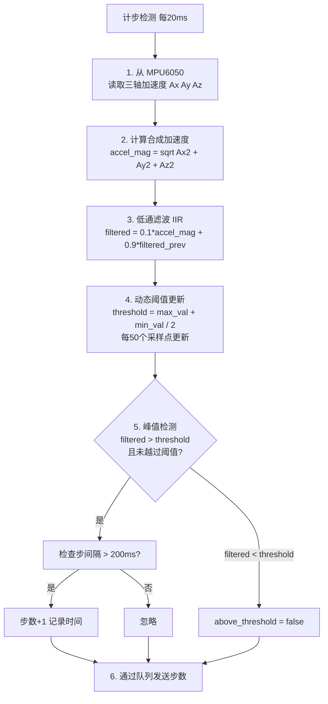
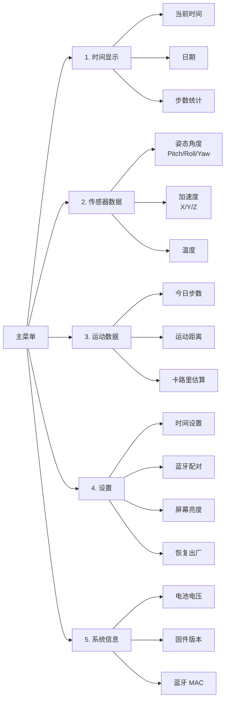
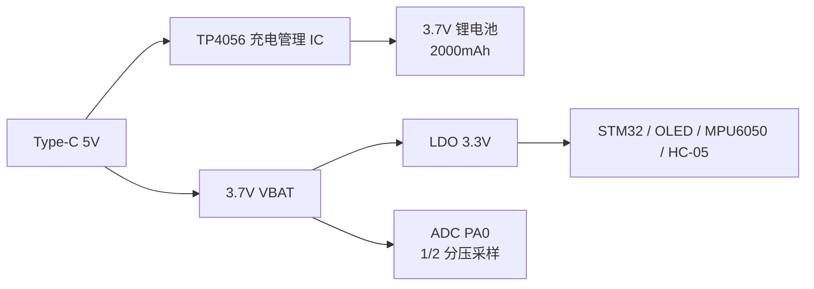

# 基于STM32F103C8T6的智能手表设计教程

本教程采用**渐进式开发**策略，每次只新增一个硬件模块，测试通过后再进入下一阶段。这样你可以始终在一个已验证可用的基础上继续开发，排错时只需关注新加入的部分。

**开发路线图：**

```
Phase 1          Phase 2          Phase 3          Phase 4           Phase 5
┌────────┐      ┌────────┐      ┌────────┐      ┌────────┐       ┌────────┐
│ OLED   │ ──► │ +MPU   │ ──► │ +HC-05 │ ──► │ +RTOS  │  ──►  │ 高级   │
│ 显示   │      │ 6050   │      │ 蓝牙   │      │ +编码器│       │ 功能   │
└────────┘      └────────┘      └────────┘      └────────┘       └────────┘
  I2C总线         I2C共享         UART总线        FreeRTOS         计步/菜单
                                                 多任务调度         /电源
```

---

## Phase 1：点亮 OLED 显示屏

**目标：** 只连接 OLED，用裸机程序在屏幕上显示 "Hello World"。

**本阶段涉及的硬件：** STM32 最小系统板、0.96寸 MK993 OLED（SSD1306 控制器，I2C 接口，4 管脚）、ST-Link 调试器。

### 1.1 硬件连接

```
OLED 模块          STM32F103C8T6
─────────         ────────────────
  VCC      ────   3.3V
  GND      ────   GND
  SCL      ────   PB6
  SDA      ────   PB7
```

> **重要：** I2C 的 SCL 和 SDA 必须接上拉电阻（4.7kΩ）到 3.3V。大多数 OLED 模块已板载上拉电阻，但建议用万用表确认。

### 1.2 STM32CubeMX 配置（Phase 1）

这一阶段只配置 I2C1，其他外设先不动。

#### 1.2.1 新建工程 + 系统核心

1. 打开 STM32CubeMX → **File → New Project** → 搜索 `STM32F103C8T6` → 双击进入
2. **System Core → SYS**：Debug 选择 **Serial Wire**，Timebase Source 选 **SysTick**
3. **System Core → RCC**：HSE 选择 **Crystal/Ceramic Resonator**

#### 1.2.2 时钟树

切换到 **Clock Configuration**，按以下配置：

- PLL Source Mux → HSE
- PLL Mul → ×9（8MHz × 9 = 72MHz）
- System Clock Mux → PLLCLK
- AHB Prescaler → /1（72MHz）
- APB1 Prescaler → /2（36MHz）
- APB2 Prescaler → /1（72MHz）

#### 1.2.3 配置 I2C1

在 **Pinout view** 中，将 PB6 设为 I2C1_SCL，PB7 设为 I2C1_SDA。

进入 I2C1 的 **Parameter Settings**：

| 配置项 | 值 |
|--------|-----|
| I2C Speed Mode | **Fast Mode** |
| Clock Speed | **400000** (Hz) |

其他参数保持默认即可。

#### 1.2.4 生成代码

**Project Manager** → Project Name 填 `SmartWatch_Phase1` → Toolchain 选 MDK-ARM 或 STM32CubeIDE → 点击 **GENERATE CODE**。

### 1.3 编写 OLED 驱动

在生成的工程中，创建 `ssd1306.c` 和 `ssd1306.h`。以下是核心驱动框架：

**ssd1306.h 关键声明：**

```c
// I2C 从机地址
#define SSD1306_ADDR    0x3C

// 基本函数
void SSD1306_Init(void);
void SSD1306_Clear(void);
void SSD1306_SetCursor(uint8_t x, uint8_t page);
void SSD1306_WriteChar(char ch);
void SSD1306_WriteString(char *str);
```

**ssd1306.c 关键实现思路：**

1. **写命令**：先发设备地址 `0x78`（写），再发 `0x00`（命令模式标记），然后发命令字节。
2. **写数据**：先发设备地址 `0x78`，再发 `0x40`（数据模式标记），然后发数据字节。
3. **初始化序列**：按 SSD1306 手册依次发送显示关闭 → 时钟分频 → 多路复用 → 显示偏移 → 启动行 → 电荷泵 → 内存寻址模式 → 段重映射 → COM 扫描方向 → COM 引脚 → 对比度 → 预充电 → VCOMH → 全屏显示 → 反色 → 显示开启。

> 完整初始化序列可参考 SSD1306 数据手册第 28 页的初始化流程图。网上有大量现成驱动，建议先拿来用，理解后再自己写。

### 1.4 编写测试代码

在 `main.c` 的 `USER CODE BEGIN 2` 和 `USER CODE BEGIN WHILE` 之间加入：

```c
/* USER CODE BEGIN 2 */
SSD1306_Init();
SSD1306_Clear();
SSD1306_SetCursor(0, 0);
SSD1306_WriteString("Hello World!");
/* USER CODE END 2 */

/* USER CODE BEGIN WHILE */
while (1)
{
    // 目前什么都不用做
    HAL_Delay(100);
}
/* USER CODE END WHILE */
```

### 1.5 烧录与验证

1. 连接 ST-Link，烧录程序
2. 观察 OLED 屏幕

**✅ Phase 1 通过标准：** 屏幕上出现清晰的 "Hello World!" 字符串，无花屏、无残影、无闪烁。

> **如果失败：** 检查 I2C 地址是否正确（大多数模块是 0x3C，少数是 0x3D）。用示波器或逻辑分析仪抓取 SCL/SDA 波形，确认是否有 ACK 响应。没有 ACK 说明接线有问题或上拉电阻缺失。

**Phase 1 完成后，保持 OLED 的连接，进入 Phase 2。**

---

## Phase 2：接入 MPU6050 陀螺仪

**目标：** 在 OLED 已有显示的基础上，新增 MPU6050，读取角度数据并显示在屏幕上。

**本阶段新增硬件：** MPU6050（GY-521 模块）。

**新增软件：** MPU6050 驱动、I2C 总线共享。

### 2.1 硬件连接（叠加在 Phase 1 之上）

MPU6050 与 OLED 共用同一组 I2C 总线——直接把 MPU6050 的 SCL/SDA 并接到现有线路上：

```
OLED 模块          MPU6050           STM32F103C8T6
─────────         ─────────         ────────────────
  SCL      ───┬───  SCL      ────   PB6
  SDA      ───┼───  SDA      ────   PB7
             │
             └── 4.7kΩ 上拉到 3.3V

  VCC      ───┬───  VCC      ────   3.3V
  GND      ───┴───  GND      ────   GND
```

> 两个设备挂在同一条 I2C 总线上，通过不同的从机地址区分。OLED 地址 `0x3C`，MPU6050 地址 `0x68`，不会冲突。

### 2.2 STM32CubeMX 改动

**无需改动。** I2C1 已经在 Phase 1 配置好了，MPU6050 使用同一总线，直接写代码即可。

> 如果你在 CubeMX 中把 PB6/PB7 做了其他用途，回到 Pinout 页面确认它们仍然是 I2C1_SCL 和 I2C1_SDA。

### 2.3 编写 MPU6050 驱动

创建 `mpu6050.c` 和 `mpu6050.h`。

**mpu6050.h 关键声明：**

```c
#define MPU6050_ADDR    0x68

// 寄存器地址
#define MPU6050_PWR_MGMT_1     0x6B
#define MPU6050_ACCEL_XOUT_H   0x3B
#define MPU6050_TEMP_OUT_H     0x41
#define MPU6050_GYRO_XOUT_H    0x43
#define MPU6050_WHO_AM_I       0x75

typedef struct {
    float accel_x, accel_y, accel_z;
    float gyro_x,  gyro_y,  gyro_z;
    float temp;
    float pitch, roll, yaw;
} MPU6050_Data;

uint8_t MPU6050_Init(void);
void MPU6050_ReadAll(MPU6050_Data *data);
```

**初始化流程（`MPU6050_Init`）：**

```
1. 写 PWR_MGMT_1 = 0x80  （复位设备）
2. 延时 100ms
3. 写 PWR_MGMT_1 = 0x00  （唤醒）
4. 写 SMPLRT_DIV = 4     （采样率 200Hz）
5. 写 CONFIG = 0x03       （DLPF 42Hz）
6. 写 ACCEL_CONFIG = 0x00 （量程 ±2g）
7. 写 GYRO_CONFIG = 0x00  （量程 ±250°/s）
8. 读 WHO_AM_I，验证 == 0x68
```

**读取数据（`MPU6050_ReadAll`）：**

从 `ACCEL_XOUT_H`（0x3B）开始连续读取 14 个字节，依次为 Accel_X、Accel_Y、Accel_Z、Temp、Gyro_X、Gyro_Y、Gyro_Z。每对高/低字节合并为 16 位有符号数。

**姿态角简化计算（互补滤波）：**

```c
// 加速度计算角度
float accel_angle = atan2f(accel_y, accel_z) * 57.2958f;  // 弧度转度

// 陀螺仪积分
static float gyro_angle = 0;
gyro_angle += (gyro_x / 131.0f) * 0.01f;  // 0.01s 采样周期

// 互补滤波
float angle = 0.98f * gyro_angle + 0.02f * accel_angle;
```

### 2.4 修改 main.c，显示传感器数据

在 Phase 1 代码的基础上修改 `main.c`：

```c
/* USER CODE BEGIN 2 */
SSD1306_Init();
SSD1306_Clear();

// 验证 MPU6050
if (MPU6050_Init() != HAL_OK) {
    SSD1306_SetCursor(0, 0);
    SSD1306_WriteString("MPU6050 Error!");
    while(1);
}
SSD1306_SetCursor(0, 0);
SSD1306_WriteString("MPU6050 OK!");
HAL_Delay(1000);
/* USER CODE END 2 */

/* USER CODE BEGIN WHILE */
while (1)
{
    MPU6050_Data data;
    MPU6050_ReadAll(&data);

    char buf[20];
    SSD1306_Clear();

    // 第0行：标题
    SSD1306_SetCursor(0, 0);
    SSD1306_WriteString("MPU6050 Data");

    // 第2行：加速度 X
    SSD1306_SetCursor(0, 2);
    sprintf(buf, "AX:%.2f AY:%.2f", data.accel_x, data.accel_y);
    SSD1306_WriteString(buf);

    // 第4行：角度
    SSD1306_SetCursor(0, 4);
    sprintf(buf, "P:%.1f R:%.1f", data.pitch, data.roll);
    SSD1306_WriteString(buf);

    // 第6行：温度
    SSD1306_SetCursor(0, 6);
    sprintf(buf, "Temp:%.1fC", data.temp);
    SSD1306_WriteString(buf);

    HAL_Delay(200);
}
/* USER CODE END WHILE */
```

### 2.5 烧录与验证

1. 烧录程序
2. OLED 先显示 "MPU6050 OK!"，然后进入数据刷新页面
3. 轻轻转动 MPU6050 模块，观察角度值是否随之变化

**✅ Phase 2 通过标准：**
- 初始化显示 "MPU6050 OK!"（WHO_AM_I 验证通过）
- 平放时 Pitch 和 Roll 接近 0°
- 转动模块时角度值平滑变化
- 温度显示在 25-35°C 左右（正常室温范围）

> **如果失败：** 最常见的是 I2C 地址问题——确认 AD0 引脚接地（地址 0x68）。其次是接线松动——两个模块共用总线时杜邦线容易接触不良，建议用面包板固定。如果 OLED 显示正常但 MPU6050 读数全为 0，检查 PWR_MGMT_1 是否写入成功（可以用调试器读寄存器确认）。

**Phase 2 完成后，保持 OLED + MPU6050 的连接，进入 Phase 3。**

---

## Phase 3：接入 HC-05 蓝牙模块

**目标：** 在已有 OLED + MPU6050 的基础上，新增蓝牙模块，通过蓝牙向手机发送传感器数据。

**本阶段新增硬件：** HC-05 蓝牙模块。

**新增软件：** USART1 驱动、蓝牙数据帧协议。

### 3.1 硬件连接（叠加在 Phase 2 之上）

蓝牙模块使用 UART 接口，与 I2C 设备完全独立，不会产生冲突。

```
HC-05 模块         STM32F103C8T6
─────────         ────────────────
  VCC      ────   3.3V  （注意：不要用 5V）
  GND      ────   GND
  TXD      ────   PA10 (USART1_RX)
  RXD      ────   PA9  (USART1_TX)
```

> HC-05 的 TXD 接 STM32 的 RX，RXD 接 STM32 的 TX——交叉连接。HC-05 模块标注的 5V 兼容仅指部分型号，建议统一用 3.3V 供电。

### 3.2 STM32CubeMX 改动

回到 CubeMX，这次需要新增 USART1。

1. 打开 Phase 2 的 `.ioc` 文件
2. **Pinout view**：将 PA9 设为 USART1_TX，PA10 设为 USART1_RX
3. 进入 USART1 的 **Parameter Settings**：

| 配置项 | 值 |
|--------|-----|
| Baud Rate | **115200** |
| Word Length | **8 Bits** |
| Parity | **None** |
| Stop Bits | **1** |

4. **NVIC Settings** 标签页：勾选 ✅ USART1 global interrupt
5. **DMA Settings** 标签页：添加 DMA1 Channel 5，Direction 选 **Peripheral To Memory**（RX 用）
6. 重新点击 **GENERATE CODE**

> **注意：** 重新生成后，你在 `USER CODE BEGIN` / `USER CODE END` 之间的代码会被保留。确保你的 OLED 和 MPU6050 代码写在正确的标记之间。

### 3.3 蓝牙 AT 配置

首次使用 HC-05 前，需要修改波特率为 115200（默认 9600）。

**方法一（推荐）：** 用 USB 转串口模块连接 HC-05，在电脑上通过串口助手发送 AT 指令。

**方法二：** 让 STM32 在初始化时通过 USART1 发送 AT 指令给 HC-05：

```
1. 上电时按住 HC-05 的按键 → 进入 AT 模式（LED 慢闪）
2. 发送 AT\r\n → 模块回复 OK
3. 发送 AT+UART=115200,0,0\r\n → 设置波特率 115200
4. 发送 AT+NAME=SmartWatch\r\n → 设置蓝牙名称
5. 重新上电（松开按键）→ 退出 AT 模式，进入透传模式
```

> 如果你不想在代码中处理 AT 模式，也可以提前用 USB 转串口工具配好 HC-05，这样代码只需处理数据收发。

### 3.4 编写蓝牙通信代码

在项目中创建 `bluetooth.c` 和 `bluetooth.h`。

**bluetooth.h 关键内容：**

```c
// 自定义数据帧
#define FRAME_STX   0xAA
#define FRAME_ETX   0x55

// 指令码
#define CMD_SYNC_TIME   0x01
#define CMD_STEP_DATA   0x02
#define CMD_SENSOR_DATA 0x03
#define CMD_SET_ALARM   0x04
#define CMD_DEV_STATUS  0x05

// 环形接收缓冲区
#define BT_RX_BUF_SIZE  256
extern uint8_t bt_rx_buf[BT_RX_BUF_SIZE];

void Bluetooth_Init(void);
void Bluetooth_SendSensorData(MPU6050_Data *data);
void Bluetooth_SendStepData(uint32_t steps);
void Bluetooth_ProcessReceived(void);
```

**接收处理思路（`Bluetooth_ProcessReceived`）：**

USART1 DMA 工作在环形模式，自动将收到的数据写入 `bt_rx_buf`。在 while(1) 中轮询缓冲区，逐字节搜索帧头 `0xAA`，找到后依次读取 CMD → LEN → DATA → CHK → 验证帧尾 `0x55`。校验通过后根据 CMD 分发处理。

**发送函数（`Bluetooth_SendSensorData`）：**

按帧格式组装：STX + CMD + LEN + DATA + CHK + ETX，通过 `HAL_UART_Transmit` 发出。例如发送传感器数据：

```c
void Bluetooth_SendSensorData(MPU6050_Data *data) {
    uint8_t frame[20];
    int16_t ax = (int16_t)(data->accel_x * 1000);  // 放大1000倍保留精度
    int16_t ay = (int16_t)(data->accel_y * 1000);
    // ... 组装各字段

    frame[0] = FRAME_STX;
    frame[1] = CMD_SENSOR_DATA;
    frame[2] = 12;  // LEN: 6个int16 = 12字节
    memcpy(&frame[3], &ax, 2);
    // ... 复制其他字段
    frame[15] = frame[1] ^ frame[2];  // 计算CHK（简化为只异或前几个）
    // ... 完整CHK
    frame[17] = FRAME_ETX;

    HAL_UART_Transmit(&huart1, frame, 18, 100);
}
```

### 3.5 修改 main.c

在 Phase 2 的 while 循环中加入蓝牙发送：

```c
while (1)
{
    MPU6050_Data data;
    MPU6050_ReadAll(&data);

    // 显示传感器数据（保留 Phase 2 的代码）
    DisplaySensorData(&data);

    // 每 500ms 通过蓝牙发送一次数据
    static uint32_t last_send = 0;
    if (HAL_GetTick() - last_send > 500) {
        Bluetooth_SendSensorData(&data);
        last_send = HAL_GetTick();
    }

    // 处理蓝牙接收的指令
    Bluetooth_ProcessReceived();

    HAL_Delay(50);
}
```

### 3.6 烧录与验证

1. 手机下载一个**蓝牙串口调试 APP**（如 "Serial Bluetooth Terminal"）
2. 手机蓝牙配对 HC-05（设备名 "SmartWatch" 或默认 "HC-05"）
3. 连接后，APP 应收到 STM32 发来的数据帧
4. 尝试从 APP 发送时间同步指令（`AA 01 04 xx xx xx xx xx 55`），观察 STM32 是否响应

**✅ Phase 3 通过标准：**
- 手机能搜索到 HC-05 蓝牙信号
- 连接成功后，手机 APP 持续收到传感器数据帧（约每 500ms 一帧）
- OLED 上的数据显示正常（不受蓝牙影响）
- 发送指令能触发 STM32 响应

> **如果失败：** 首先确认 HC-05 波特率是否为 115200（默认 9600，必须先用 AT 指令改）。其次确认 TX/RX 是否交叉连接（TX↔RX，不是 TX↔TX）。用逻辑分析仪或串口助手分别监控 TX 和 RX 确认数据流向。

**Phase 3 完成后，保持 OLED + MPU6050 + HC-05 的连接，进入 Phase 4。**

---

## Phase 4：FreeRTOS 多任务 + 旋转编码器

**目标：** 将裸机代码迁移到 FreeRTOS，同时接入旋转编码器实现菜单交互。

**本阶段新增硬件：** EC11 旋转编码器。

**新增软件：** FreeRTOS 配置、5 个任务、消息队列、信号量、互斥锁、菜单逻辑。

### 4.1 为什么要在这个阶段引入 FreeRTOS？

前三阶段是裸机程序，所有代码跑在 while(1) 里靠 `HAL_Delay` 协调。当功能增多时，你会发现：
- OLED 刷新需要 50ms，传感器读取需要 200ms，蓝牙需要 100ms——它们互相阻塞
- 编码器按键需要实时响应，但 while 循环可能在执行耗时操作
- 多个模块共享 I2C 总线，裸机下容易冲突

FreeRTOS 为每个模块分配一个独立任务，由操作系统自动调度，高优先级任务可以抢占低优先级任务，消息队列安全地在任务间传递数据。

### 4.2 硬件连接（叠加在 Phase 3 之上）

```
EC11 编码器        STM32F103C8T6
──────────        ────────────────
  A 相      ────   PA6  (TIM3_CH1)
  B 相      ────   PA7  (TIM3_CH2)
  SW (按键) ────   PB10 (EXTI10, 上拉输入)
  VCC       ────   3.3V
  GND       ────   GND
```

> EC11 的 A 相和 B 相内部是机械触点，建议在 A/B 相与 GND 之间各接一个 100nF 的去抖电容。软件层面，TIM3 编码器模式本身就有一定的去抖能力。

### 4.3 STM32CubeMX 改动

这是改动最大的一次——启用 FreeRTOS 并配置定时器。

#### 4.3.1 启用 FreeRTOS

1. **Pinout & Configuration → Middleware → FREERTOS** → Interface 选 **CMSIS_V1**
2. **Config Parameters** 标签页：

| 配置项 | 值 |
|--------|-----|
| TOTAL_HEAP_SIZE | **8192** |
| Memory management scheme | **heap_4** |
| TICK_RATE_HZ | **1000** |
| MAX_PRIORITIES | **32** |

#### 4.3.2 创建任务（Tasks 标签页）

点击 **Add** 添加 5 个任务：

| 任务名称 | Entry Function | Priority | Stack Size |
|----------|---------------|----------|------------|
| taskTimeKeep | vTask_TimeKeep | osPriorityHigh | 256 |
| taskSensor | vTask_Sensor | osPriorityAboveNormal | 512 |
| taskDisplay | vTask_Display | osPriorityNormal | 1024 |
| taskMenu | vTask_Menu | osPriorityNormal | 512 |
| taskBluetooth | vTask_Bluetooth | osPriorityBelowNormal | 512 |

#### 4.3.3 创建队列与信号量

**Queues 标签页：**

| 队列名称 | Item Size | Items |
|----------|-----------|-------|
| queueSensorData | 24 | 4 |
| queueTimeUpdate | 8 | 2 |
| queueMenuMsg | 4 | 4 |
| queueBtCmd | 32 | 4 |

**Mutexes 标签页：** 添加 `mutexI2C`

**Semaphores 标签页：** 添加 `semDisplayUpdate`（Binary）

#### 4.3.4 配置 TIM2 和 TIM3

**TIM2 — 软件计时（秒中断）：**

| 配置项 | 值 |
|--------|-----|
| Prescaler | **7199** |
| Counter Period | **9999** |
| NVIC: TIM2 global interrupt | ✅ 勾选，优先级 5 |

**TIM3 — 编码器模式：**

| 配置项 | 值 |
|--------|-----|
| Combined Channels | **Encoder Mode** |
| Prescaler | **0** |
| Counter Period | **65535** |

#### 4.3.5 设置 NVIC 优先级

| 中断源 | Preemption Priority |
|--------|--------------------|
| SysTick | 15 |
| TIM2 | 5 |
| I2C1 event | 6 |
| I2C1 error | 6 |
| USART1 | 7 |
| EXTI10 | 7 |

#### 4.3.6 修改 SYS Timebase

回到 **System Core → SYS**，将 Timebase Source 从 SysTick 改为 **TIM1**（避免与 FreeRTOS 的 SysTick 冲突）。

#### 4.3.7 重新生成代码

点击 **GENERATE CODE**。生成后检查你的驱动文件（`ssd1306.c`、`mpu6050.c`、`bluetooth.c`）是否还在项目中，如果 CubeMX 移除了它们，手动重新添加。

### 4.4 任务代码框架

#### taskTimeKeep（优先级 4，每秒执行）

```c
void vTask_TimeKeep(void *pvParameters)
{
    TickType_t xLastWakeTime = xTaskGetTickCount();
    TimeData time = {0};  // 时、分、秒、日、月、年

    for (;;) {
        // 每秒递增一次
        time.sec++;
        if (time.sec >= 60) { time.sec = 0; time.min++; }
        if (time.min >= 60) { time.min = 0; time.hour++; }
        if (time.hour >= 24) { time.hour = 0; /* 日期+1 */ }

        // 通过队列发送给显示任务
        xQueueSend(queueTimeUpdate, &time, 0);

        vTaskDelayUntil(&xLastWakeTime, pdMS_TO_TICKS(1000));
    }
}
```

#### taskSensor（优先级 3，每 200ms 执行）

```c
void vTask_Sensor(void *pvParameters)
{
    TickType_t xLastWakeTime = xTaskGetTickCount();
    SensorData data;

    for (;;) {
        // 获取 I2C 互斥锁（最多等 100ms，防止死锁）
        if (xSemaphoreTake(mutexI2C, pdMS_TO_TICKS(100)) == pdTRUE) {
            MPU6050_ReadAll(&data.raw);
            xSemaphoreGive(mutexI2C);
        }

        // 计算姿态角（互补滤波）
        ComputeAttitude(&data);

        // 计步算法（详见 Phase 5）
        // StepDetection(&data);

        // 发送给显示任务
        xQueueSend(queueSensorData, &data, 0);

        // 触发刷新
        xSemaphoreGive(semDisplayUpdate);

        vTaskDelayUntil(&xLastWakeTime, pdMS_TO_TICKS(200));
    }
}
```

#### taskDisplay（优先级 2，信号量驱动）

```c
void vTask_Display(void *pvParameters)
{
    TimeData time;
    SensorData sensor;

    for (;;) {
        // 等待刷新信号量（最多等 500ms 兜底刷新）
        xSemaphoreTake(semDisplayUpdate, pdMS_TO_TICKS(500));

        // 非阻塞读取最新数据
        xQueueReceive(queueTimeUpdate,  &time,   0);
        xQueueReceive(queueSensorData,  &sensor, 0);

        // 渲染当前页面
        if (xSemaphoreTake(mutexI2C, pdMS_TO_TICKS(50)) == pdTRUE) {
            RenderPage(&time, &sensor);
            xSemaphoreGive(mutexI2C);
        }
    }
}
```

#### taskMenu（优先级 1，每 20ms 轮询）

```c
void vTask_Menu(void *pvParameters)
{
    TickType_t xLastWakeTime = xTaskGetTickCount();
    MenuState menu = {0};

    for (;;) {
        // 读取编码器旋转方向
        int16_t encoder_delta = (int16_t)TIM3->CNT;
        TIM3->CNT = 0;  // 清零

        // 检测按键（短按/长按）
        uint8_t btn_event = ReadEncoderButton();

        if (encoder_delta != 0 || btn_event != BTN_NONE) {
            MenuMsg msg = { .delta = encoder_delta, .button = btn_event };
            xQueueSend(queueMenuMsg, &msg, 0);
            xSemaphoreGive(semDisplayUpdate);
        }

        vTaskDelayUntil(&xLastWakeTime, pdMS_TO_TICKS(20));
    }
}
```

#### taskBluetooth（优先级 0，每 100ms 执行）

```c
void vTask_Bluetooth(void *pvParameters)
{
    TickType_t xLastWakeTime = xTaskGetTickCount();

    for (;;) {
        // 检查 DMA 环形缓冲区是否有新数据
        Bluetooth_ProcessReceived();

        // 定期发送设备状态
        static uint32_t count = 0;
        if (++count % 10 == 0) {  // 每 1 秒
            Bluetooth_SendStatus();
        }

        vTaskDelayUntil(&xLastWakeTime, pdMS_TO_TICKS(100));
    }
}
```

### 4.5 迁移步骤

1. 将 Phase 3 的 while(1) 主循环代码拆分到对应任务中
2. OLED 相关的 I2C 操作都加上 `xSemaphoreTake(mutexI2C, ...)` / `xSemaphoreGive(mutexI2C)`
3. 把 `HAL_Delay` 全部替换为 `vTaskDelay` 或 `vTaskDelayUntil`
4. main 函数末尾的 `while(1)` 可以删除——FreeRTOS 启动后不会返回
5. 编译，烧录

### 4.6 验证

**✅ Phase 4 通过标准：**
- 上电后 OLED 正常显示时间页面，每秒更新
- 旋转编码器可以切换页面（时间页 ↔ 传感器页），短按确认
- 传感器数据实时更新
- 蓝牙数据持续发送（手机 APP 确认）
- 旋转编码器时，OLED 显示不卡顿（说明任务调度正常）
- 连续运行 10 分钟无死机

> **如果失败：** 最常见的 FreeRTOS 问题是堆栈溢出——检查 `vTaskList` 或各任务的 `uxTaskGetStackHighWaterMark`。如果某个任务的水位接近 0，增大其 Stack Size。其次是 I2C 死锁——检查所有 I2C 操作前是否获取了 mutex，操作后是否释放（包括异常路径）。可以用逻辑分析仪同时抓 I2C 信号和各任务的 GPIO 翻转来排查。

**Phase 4 完成后，你已经有了一款可用的智能手表原型。进入 Phase 5 添加高级功能。**

---

## Phase 5：高级功能

**目标：** 在 RTOS 稳定运行的基础上，添加计步算法、多级菜单、电源管理等增强功能。

### 5.1 计步算法

在 `taskSensor` 中每 20ms 调用一次计步检测函数（可以将 taskSensor 的周期改为 20ms，或内部用计数器每 10 次循环执行一次计步）。



**关键参数：**

| 参数 | 推荐值 | 说明 |
|------|--------|------|
| α（滤波系数） | 0.1 | 值越小滤波越强，但延迟越大 |
| 最小步间隔 | 200ms | 最快 300 步/分 |
| 动态阈值窗口 | 50 采样 | 约 1 秒的数据 |
| 基础阈值 | 1.1g | 低于此值不触发计步 |

> **调试方法：** 先用蓝牙或串口把 `filtered` 值和 `threshold` 值实时传出来，在电脑上画波形图。走路时合成加速度应有规律的波峰波谷，峰值通常 1.2g~2.0g。根据波形调整滤波系数和阈值。

### 5.2 多级菜单

**菜单树结构：**



**编码器操作映射：**

| 操作 | 在菜单层 | 在设置层 |
|------|----------|----------|
| 顺时针旋转 | 光标下移 | 数值增大 |
| 逆时针旋转 | 光标上移 | 数值减小 |
| 短按 (<500ms) | 进入子菜单 | 确认选择 |
| 长按 (>1s) | 返回上级 | 取消 / 返回 |

**实现思路：** 在 `taskMenu` 中维护一个 `MenuState` 结构体：

```c
typedef struct {
    uint8_t current_level;   // 当前层级（0=主菜单, 1=子菜单, 2=设置项）
    uint8_t cursor_pos;      // 当前光标位置
    uint8_t page_index;      // 当前显示页面
    uint32_t btn_press_time; // 按键按下时刻
} MenuState;
```

TIM3 编码器模式下，读取 CNT 的变化量判断旋转方向和步数。按键通过 EXTI10 中断触发，记录按下的 systick 时间，在 taskMenu 中判断短按/长按。

### 5.3 电源管理

**供电链路：**



**低功耗策略（按需实现）：**

| 状态 | 动作 | 功耗 |
|------|------|------|
| 正常运行 | 全速 72MHz，所有外设工作 | ~30mA |
| 熄屏 | OLED 发送休眠命令（0xAE），其余继续 | ~15mA |
| 待机 | STM32 STOP 模式，外设断电 | ~50μA |

熄屏模式最简单：在 taskDisplay 中，如果超过 10 秒无编码器操作（通过 queueMenuMsg 的超时判断），发送 OLED 休眠命令，之后 take 到 semDisplayUpdate 时再唤醒。

---

## 附录 A：物料清单

| 序号 | 物料 | 型号/规格 | 数量 | 参考价 | 对应 Phase |
|------|------|-----------|------|--------|-----------|
| 1 | 主控 | STM32F103C8T6 最小系统板 | 1 | ¥15 | Phase 1 |
| 2 | 显示屏 | 0.96寸 MK993 SSD1306 I2C 4管脚 (128×64) | 1 | ¥12 | Phase 1 |
| 3 | 陀螺仪 | MPU6050 GY-521 模块 | 1 | ¥5 | Phase 2 |
| 4 | 蓝牙 | HC-05 主从一体 | 1 | ¥10 | Phase 3 |
| 5 | 编码器 | EC11（带按键） | 1 | ¥2 | Phase 4 |
| 6 | LDO | AMS1117-3.3V | 1 | ¥1.5 | Phase 1 |
| 7 | 电池 | 3.7V 2000mAh 聚合物 | 1 | ¥15 | Phase 1 |
| 8 | 充电管理 | TP4056 Type-C | 1 | ¥3 | Phase 1 |
| 9 | 面包板 | 5×7cm | 1 | ¥3 | Phase 1 |
| 10 | 杜邦线 | 公母各 20 根 | 1 套 | ¥3 | Phase 1 |
| 11 | 电阻电容 | 多种规格 | 若干 | ¥2 | — |
| 12 | PMOS 管 | AO3401 | 1 | ¥0.5 | Phase 5 |
| 13 | ST-Link | ST-Link V2 | 1 | ¥8 | Phase 1 |

**总成本：约 ¥80**

---

## 附录 B：I2C 设备地址速查

| 设备 | 7位地址 | 写地址 | 读地址 | 地址引脚 |
|------|---------|--------|--------|----------|
| SSD1306 | 0x3C | 0x78 | 0x79 | SA0 = GND |
| SSD1306（备选） | 0x3D | 0x7A | 0x7B | SA0 = VCC |
| MPU6050 | 0x68 | 0xD0 | 0xD1 | AD0 = GND |
| MPU6050（备选） | 0x69 | 0xD2 | 0xD3 | AD0 = VCC |

## 附录 C：FreeRTOS 关键宏定义

```c
#define configUSE_PREEMPTION            1
#define configUSE_TIME_SLICING          1
#define configTICK_RATE_HZ              1000
#define configMAX_PRIORITIES            32
#define configMINIMAL_STACK_SIZE        128
#define configTOTAL_HEAP_SIZE           ((size_t)8192)
#define configMAX_TASK_NAME_LEN         16
#define configUSE_MUTEXES               1
#define configUSE_COUNTING_SEMAPHORES   1
#define configQUEUE_REGISTRY_SIZE       8
#define configLIBRARY_MAX_SYSCALL_INTERRUPT_PRIORITY  5
```

## 附录 D：调试技巧汇总

1. **I2C 调试**：先用 `HAL_I2C_IsDeviceReady` 扫描总线上有哪些设备地址响应。如果返回 HAL_ERROR，99% 是硬件问题（接线、上拉电阻、供电）。
2. **FreeRTOS 堆栈监控**：在调试阶段定期调用 `uxTaskGetStackHighWaterMark` 打印各任务的剩余栈空间。小于 50 words 时增大栈。
3. **逻辑分析仪**：I2C 和 UART 的问题用逻辑分析仪一目了然。便宜的 24MHz 8ch 分析仪（¥30 左右）配合 PulseView 足够用。
4. **GPIO 翻转标记**：在每个任务的关键路径上翻转不同的 GPIO 引脚，用逻辑分析仪观察任务调度时序。
5. **蓝牙调试**：先用电脑的蓝牙串口助手验证 HC-05 的 AT 配置和数据收发，确认模块本身没问题，再连 STM32。
